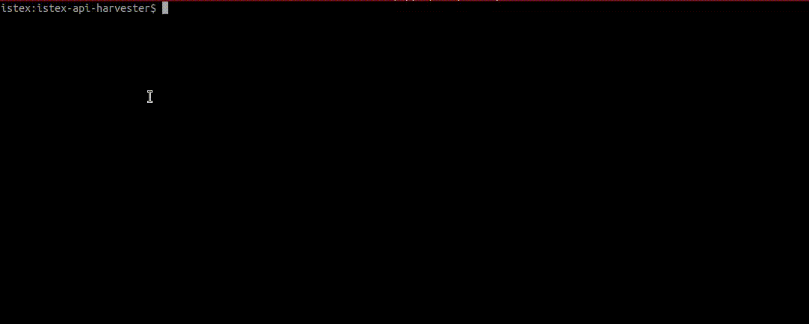

# istex-api-harvester

Utilitaire en ligne de commande permettant de moissonner les corpus proposés par l'API de la plateforme ISTEX. 

Encore à l'état de développement, il a vocation à remplacer les précédentes version du moissonneur, à savoir :

- la très ancienne [version expérimentale en BASH](https://github.com/istex/istex-api-harvester/tree/master/misc/bash).
- la version Node actuellement [disponible sur la branche master](https://github.com/istex/istex-api-harvester/tree/master) et [sur npmjs](https://www.npmjs.com/package/istex-api-harvester).

## 🚧 Important 🚧
Cette version du moissonneur n'est pas complètement finalisée et peut contenir des bugs ou limitations.
Certaines options du moissonneur d'origine n'ont pas encore été ré-implémentées, en particulier :

- le tri et le classement (`--sortby` et `--rankby`)
- la possibilité de ne pas ventiler les documents dans une arborescence à 3 niveaux (`--spread`)
- le téléchargement des enrichissements (qui n'est pas non plus disponible dans la version actuelle)

Malgré ces limitations, cette version possède quelques avantages par rapport à la version actuelle :

- sa conception en 2 étapes la rend **plus fiable**
- l'étape de téléchargement proprement dite permet une **reprise en cas d'interruption**
- un option permet de récupérer simplement des métadonnées issues du format JSON ISTEX, et de les sauvegarder dans un fichier CSV

## Principe de Fonctionnement 

Cet utilitaire s'utilise en 2 étapes et se compose des 2 commandes `get-dotcorpus.njs` et `dotcorpus-harvest.njs`.
Le rôle de chacune des 2 commandes est de :

1) récupérer la liste des identifiants des documents correspondant à une équation de recherche ISTEX. En option, il est possible de récupérer des métadonnées simples dans un fichier CSV de sortie
2) pour chacun des identifiants obtenus en `1.`, télécharger les formats de fichiers souhaités (par exemple `JSON`, `Mods` ou `TEI`)



## Pré requis

Les prérequis pour l'utiliser sont :
* disposer de la commande `git` pour récupérer une copie du dépôt
* Avoir nodejs d'installé sur sa machine (de préférence sur un OS de type Unix) -> http://nodejs.org/
* Disposer d'un accès réseau et d'avoir une adresse ip autorisée par la plateforme ISTEX

## Installation

Ouvrez un terminal, placez-vous dans le répertoire de votre choix et lancez les commandes suivantes :

```bash
git clone https://github.com/istex/istex-api-harvester.git -b 2-pass-harvesting
cd 2-pass-harvesting
npm install
```

## 1ère étape : récupération de la liste des identifiants

Cette étape prend en entrée une équation de recherche, interroge l'API ISTEX et enregistre la liste des identifiants trouvés dans un fichier résultat au format `.corpus`. Pour plus d'informations sur ce format, vous pouvez vous reporter à la [documentation de harvest-corpus](https://github.com/istex/harvest-corpus#1---fichier-corpus), un autre outil de moissonnage d'ISTEX.

En option, il est possible de récupérer des métadonnées et de les enregistrer dans un fichier CSV.

Cette étape utilise la commande `get-dotcorpus.njs`, qui s'utilise ainsi :

```
  Usage: get-dotcorpus.njs [options]

  Options:

    -h, --help                          output usage information
    -V, --version                       output the version number
    -q, --query [requete]               La requete (?q=) 
    -j, --jwt [token]                   Le token à utiliser pour l'authentification
    -o, --output [corpusFile path]      fichier .corpus obtenu
    -c, --csv [coma-separated-columns]  génère un fichier csv en plus du .corpus, en extrayant des infos du json selon [columns]
    -i, --idIstex                       récupère des idIstex au lieu d'identifiants ARK
    -H, --host [host:port]              interrogation sur un hostname (ou @IP) particulier
    -v, --verbose                       Affiche plus d'informations
```

Par exemple, pour récupérer les identifiants des documents dont le titre contient "*surface chemistry*" et sauvegarder le résultat dans le fichier `surface-chemistry.corpus`, il faut taper ceci :

`./get-dotcorpus.njs -q 'title:"surface chemistry"' -o surface-chemistry.corpus`

Le début du fichier `surface-chemistry.corpus` obtenu ressemblera à ceci :

```
#
# Fichier .corpus
#
query        : title:"surface chemistry"
date         : 2022-01-04T16:52:29+0100
total        : 1666

[ISTEX]
ark ark:/67375/QHD-QXHFWHRG-4
ark ark:/67375/P0J-CV1N8VQH-4
ark ark:/67375/QHD-F3984WV1-3
ark ark:/67375/QHD-C6VVHSD5-F
ark ark:/67375/80W-DFKVDFSJ-W
ark ark:/67375/6H6-QJC4DGHR-3
ark ark:/67375/80W-0J0H5BDW-3
```

Si vous souhaitez récupérer des identifiants ISTEX au lieux d'identifiants ARK, vous pouvez utiliser l'option `--idIstex`.

Si en plus vous souhaitez récupérer les noms de corpus, DOI, ISSN et titres de revue dans un fichier CSV, utilisez la commande :

```
./get-dotcorpus.njs -q 'title:"surface chemistry"' -o surface-chemistry.corpus -c idIstex,corpusName,doi,host.issn,host.title
```

Les 5 premières lignes du fichier obtenu devraient ressembler à ceci :

```
"7C2938681BB4265C9E2B6A505D4A283FFDEA8E6B","rsc-journals","10.1039/b901745c","1359-7345","Chemical Communications"
"5297C13B24CC12589B0CDB19F281D15ED1530DB6","rsc-ebooks","10.1039/9781847550200-00063","","Basic Principles of Colloid Science"
"88E81528B7C9BE2BD0B3AF5DC9F1DBC36F0B2689","rsc-journals","10.1039/b719148k","0306-0012","Chemical Society Reviews"
"4572FE4752CE5D2B81EB96D956E65D1605E04F72","rsc-journals","10.1039/b719551f","0306-0012","Chemical Society Reviews"
"CB2998B15F6B57A17AD3A6572EC3E91647DEF2DA","edp-sciences","10.1051/0004-6361/201016013","0004-6361","Astronomy & Astrophysics"
```

## 2ème étape : téléchargements des documents

Cette étape prend en entrée le fichier `.dotcorpus` produit à l'étape 1 et télécharge les formats de fichiers souhaités. Ceux-ci sont placés dans une arborescence à 3 niveaux pour limiter le nombre de documents dans un seul répertoire.

Cette étape utilise la commande `dotcorpus-harvest.njs`, qui s'utilise ainsi :

```
  Usage: dotcorpus-harvest.njs [options]

  Options:

    -h, --help                        output usage information
    -V, --version                     output the version number
    -d, --dotcorpus [dotcorpus path]  Path du fichier dotcorpus
    -j, --jwt [token]                 Le token à utiliser pour l'authentification
    -o, --output [outputdir path]     Répertoire où seront téléchargés les fichiers
    -M, --metadata [formats]          Pour retourner seulement certain formats de metadata (ex: mods,xml)
    -F, --fulltext [formats]          Pour retourner seulement certain formats de plein text (ex: tei,pdf)
    -w, --workers [nbWorkers]         nombre de workers fonctionnant en parallèle (permet de télécharger plusieurs pages simultanément)
    -H, --host [host:port]            interrogation sur un hostname (ou @IP) particulier
    -v, --verbose                     Affiche plus d'informations

```

Par exemple, si vous souhaitez télécharger les formats JSON, Mods et TEI et les enregistrer dans un répertoire nommé `surface-chemistry`, exécutez la commande : 

`./dotcorpus-harvest.njs -d surface-chemistry.corpus -o surface-chemistry -M json,mods -F tei`

Les fichiers téléchargés seront organisés ainsi :

```
surface-chemistry
├── 0
│   └── J
│       └── 0
│           ├── 67375_80W-0J0H5BDW-3.fulltext.tei.xml
│           ├── 67375_80W-0J0H5BDW-3.metadata.json
│           └── 67375_80W-0J0H5BDW-3.metadata.mods.xml
├── C
│   ├── 6
│   │   └── V
│   │       ├── 67375_QHD-C6VVHSD5-F.fulltext.tei.xml
│   │       ├── 67375_QHD-C6VVHSD5-F.metadata.json
│   │       └── 67375_QHD-C6VVHSD5-F.metadata.mods.xml
etc...
```

Si vous téléchargez des formats autres que Mods et JSON, et que votre adresse IP n'est pas reconnue par l'API ISTEX, vous devrez préalablement [générer un token JWT](https://doc.istex.fr/api/access/fede.html#1%C3%A8re-%C3%A9tape--g%C3%A9n%C3%A9ration-du-token) et le renseigner avec l'option `-j` :

`./dotcorpus-harvest.njs -d surface-chemistry.corpus -o surface-chemistry -F tei -j <MONTOKEN>`

(*remplacer `<MONTOKEN>` par votre token personnel*)

